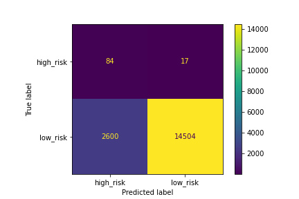
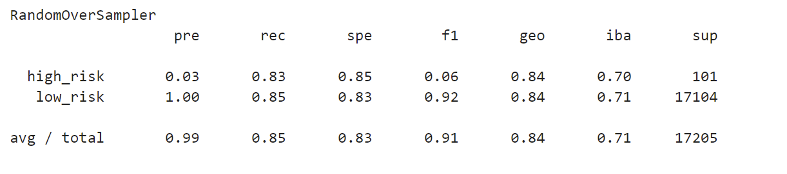

# Credit_Risk_Analysis

# Challenge Expanded Instructions

The objective of this challenge is for learners to implement machine learning models using resampling and ensemble to address class imbalance, and evaluate the performance of different machine learning models.

## Deliverable 1: Use Resampling Models to Predict Credit Risk 

* For all three algorithms, the following have been completed:
  - An accuracy score for the model is calculated (7.5 pt)

  - confusion matrix has been generated  

  - imbalanced classification report has been generated 
  

* **RandomOverSampler**

## Deliverable 2: Use the SMOTEENN algorithm to Predict Credit Risk

* The combinatorial SMOTEENN algorithm does the following:
  - An accuracy score for the model is calculated (5 pt)
  - A confusion matrix has been generated (5 pt)
  - An imbalanced classification report has been generated (5 pt)

## Deliverable 3: Use Ensemble Classifiers to Predict Credit Risk

* The BalancedRandomForestClassifier algorithm does the following:
  - An accuracy score for the model is calculated (2.5 pt)
  - A confusion matrix has been generated (2.5 pt)
  - An imbalanced classification report has been generated (5 pt)
  - The features are sorted in descending order by feature importance (5 pt)

* The EasyEnsembleClassifier algorithm does the following:
  - An accuracy score of the model is calculated (2.5 pt)
  - A confusion matrix has been generated (2.5 pt)
  - An imbalanced classification report has been generated (5 pt)

**Overview of the analysis:** Explain the purpose of this analysis.

**Results:** Using bulleted lists describe the results of the balanced accuracy score and the precision and recall scores of all six machine learning models. Use screenshots of your outputs to support your results.

**Summary:** Summarize the results of the machine learning models and include a recommendation on the model to use, if any. If you do not recommend any of the models, justify your reasoning.  

The README.md document should be in the home directory of their repository. All links should be working, and images should be formatted and displayed where appropriate.